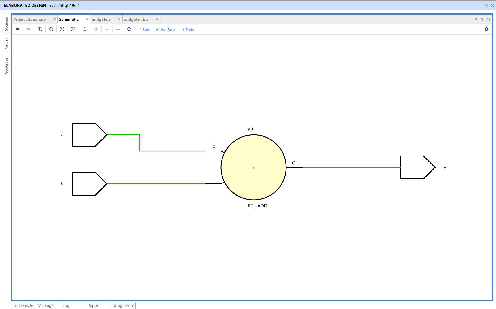
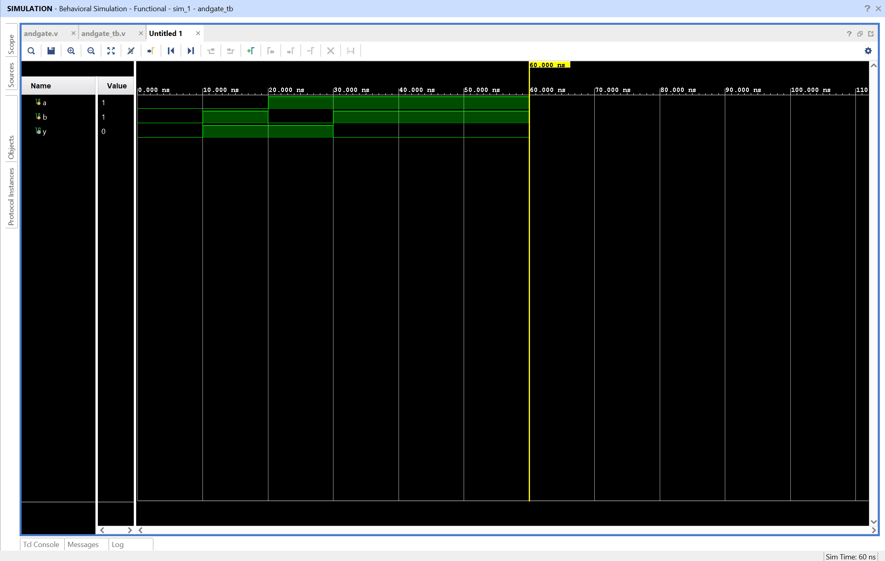

# AND Gate – Verilog Implementation

## Objective

Design and simulate an AND gate using Verilog in AMD Vivado.  
The circuit performs a logical AND operation on two binary inputs.

## AND Gate

An AND gate is a basic combinational logic gate that outputs 1 only when both inputs are 1.

Inputs  
A, B

Output  
Y

Logic equation

Y = A · B

The output is high only when both inputs are high. For all other input combinations, the output remains low.

## Truth Table

| A   | B   | Y = A · B |
| --- | --- | --------- |
| 0   | 0   | 0         |
| 0   | 1   | 0         |
| 1   | 0   | 0         |
| 1   | 1   | 1         |

## Files

andgate.v – Verilog design module implementing AND logic  
andgate_tb.v – Testbench used for simulation

## RTL Schematic

The RTL schematic shows a single logical operation block connecting inputs **a** and **b** to output **y**.

Vivado represents the AND operation using an RTL_ADD block internally, but the behavior corresponds to logical AND as defined in the code.

Both inputs feed into the block, and the output reflects their combined logical result.

## Simulation Waveform

The waveform verifies the AND gate behavior over time.

Inputs **a** and **b** are toggled by the testbench.  
The output **y** changes according to the AND logic.

Observations:

- When either input is 0, output remains 0
- When both inputs are 1, output becomes 1

This confirms correct functionality of the AND gate.
