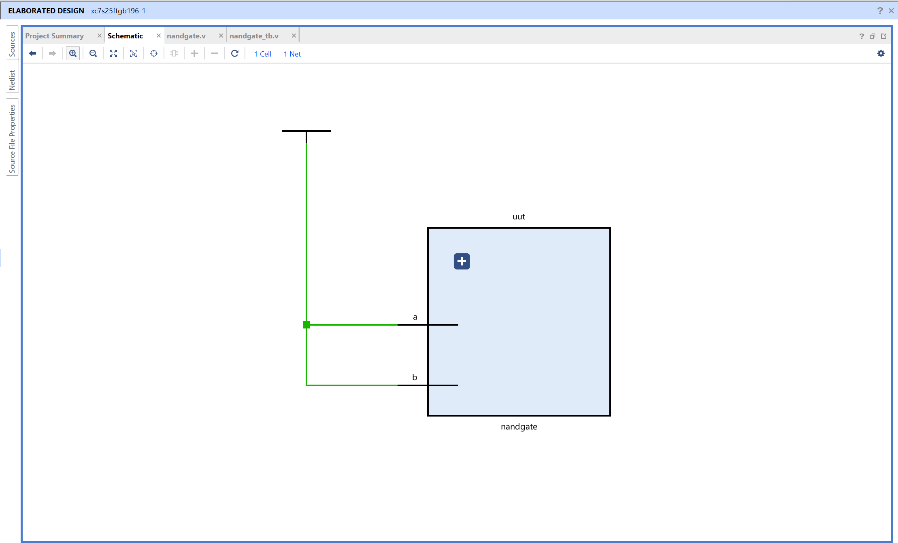
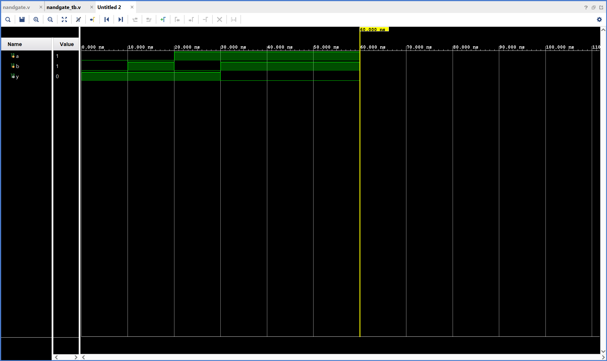

# NAND Gate - Verilog Implementation

## Objective

Design and simulate a NAND gate using Verilog in AMD Vivado.
The circuit performs a NOT-AND operation on two binary inputs.

## NAND Gate

A NAND gate is a basic combinational logic gate that outputs 0 only when both inputs are 1.

Inputs
A, B

Output
Y

Logic equation

Y = ~(A · B)

The output is low only when both inputs are high. For all other input combinations, the output remains high.

## Truth Table

| A   | B   | Y = ~(A · B) |
| --- | --- | ------------ |
| 0   | 0   | 1            |
| 0   | 1   | 1            |
| 1   | 0   | 1            |
| 1   | 1   | 0            |

## Files

nandgate - Verilog design module implementing NAND logic
nandgate_tb – Testbench used for simulation

## RTL Schematic

The RTL schematic shows a single logical operation block connecting inputs **a** and **b** to output **y**.

Vivado represents the NAND operation using an RTL block internally, but the behavior corresponds to NAND logic as defined in the code.

Both inputs feed into the block, and the output reflects the inverted result of their logical AND operation.

## Simulation Waveform

The waveform verifies the NAND gate behavior over time.

Inputs **a** and **b** are toggled by the testbench.
The output **y** changes according to the NAND logic.

Observations:

- When either input is 0, output remains 1
- When both inputs are 1, output becomes 0

This confirms correct functionality of the NAND gate.
