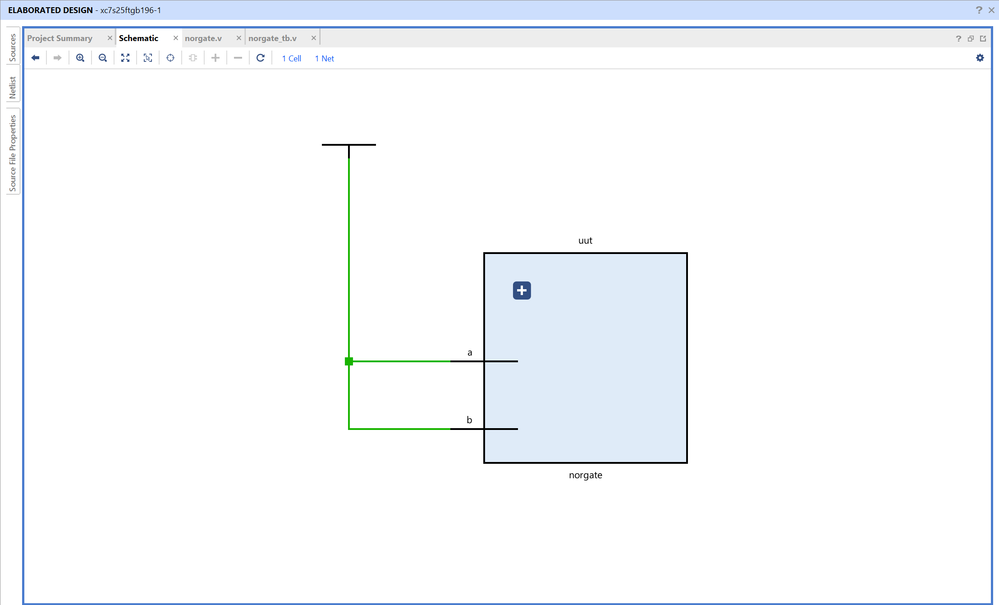
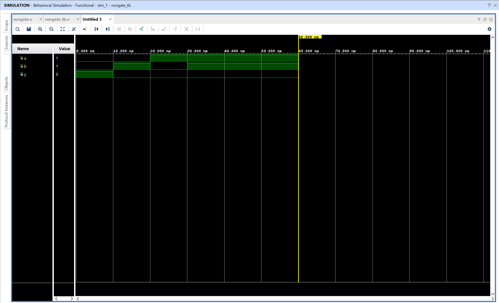

# NOR Gate - Verilog Implementation

## Objective

Design and simulate a NOR gate using Verilog in AMD Vivado.
The circuit performs a NOT-OR operation on two binary inputs.

## NOR Gate

A NOR gate is a basic combinational logic gate that outputs 1 only when both inputs are 0.

Inputs
A, B

Output
Y

Logic equation

Y = ~(A | B)

The output is high only when both inputs are low. For all other input combinations, the output remains low.

## Truth Table

| A   | B   | Y = ~(A | B)  |
| --- | --- | ------- | --- |
| 0   | 0   | 1       |
| 0   | 1   | 0       |
| 1   | 0   | 0       |
| 1   | 1   | 0       |

## Files

norgate.v - Verilog design module implementing NOR logic
norgate_tb.v - Testbench used for simulation

## RTL Schematic

The RTL schematic shows a single logical operation block connecting inputs **a** and **b** to output **y**.

Vivado represents the NOR operation using an RTL block internally, but the behavior corresponds to NOR logic as defined in the code.

Both inputs feed into the block, and the output reflects the inverted result of their logical OR operation.

## Simulation Waveform

The waveform verifies the NOR gate behavior over time.

Inputs **a** and **b** are toggled by the testbench.
The output **y** changes according to the NOR logic.

Observations:

- When both inputs are 0, output becomes 1
- When either input is 1, output remains 0

This confirms correct functionality of the NOR gate.
