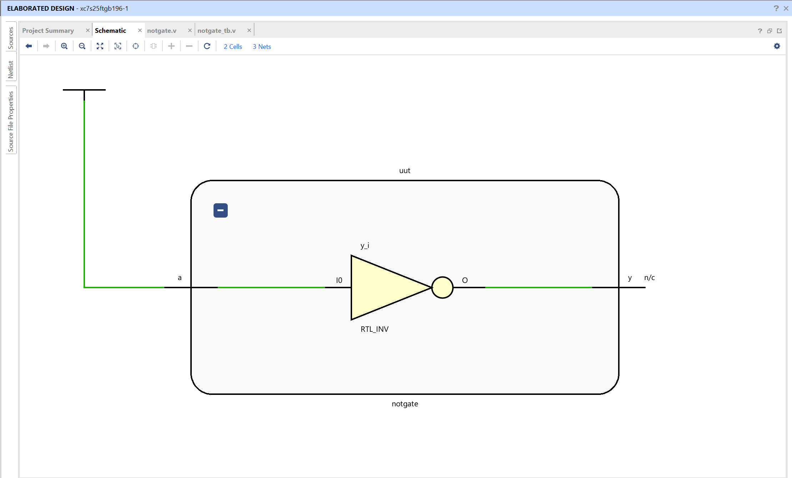
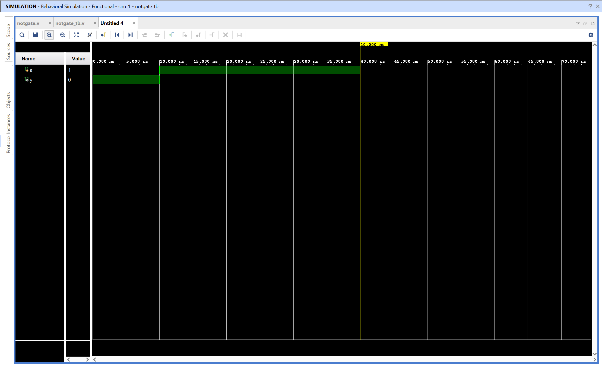

# NOT Gate - Verilog Implementation

## Objective

Design and simulate a NOT gate using Verilog in AMD Vivado.
The circuit inverts a single binary input.

## NOT Gate

A NOT gate is a basic combinational logic gate that outputs the inverse of its input.

Input
A

Output
Y

Logic equation

Y = ~A

The output is high when the input is low, and low when the input is high.

## Truth Table

| A   | Y = ~A |
| --- | ------ |
| 0   | 1      |
| 1   | 0      |

## Files

notgate.v - Verilog design module implementing NOT logic
notgate_tb.v - Testbench used for simulation

## RTL Schematic

The RTL schematic shows a single logical operation block connecting input **a** to output **y**.

Vivado represents the NOT operation using an RTL block internally, but the behavior corresponds to NOT logic as defined in the code.

The output is the inverted value of the input.

## Simulation Waveform

The waveform verifies the NOT gate behavior over time.

Input **a** is toggled by the testbench.
The output **y** changes according to the NOT logic.

Observations:

- When the input is 0, output becomes 1
- When the input is 1, output becomes 0

This confirms correct functionality of the NOT gate.
