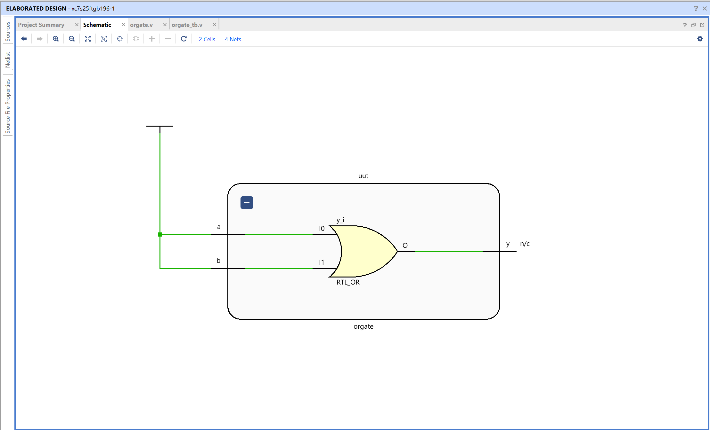
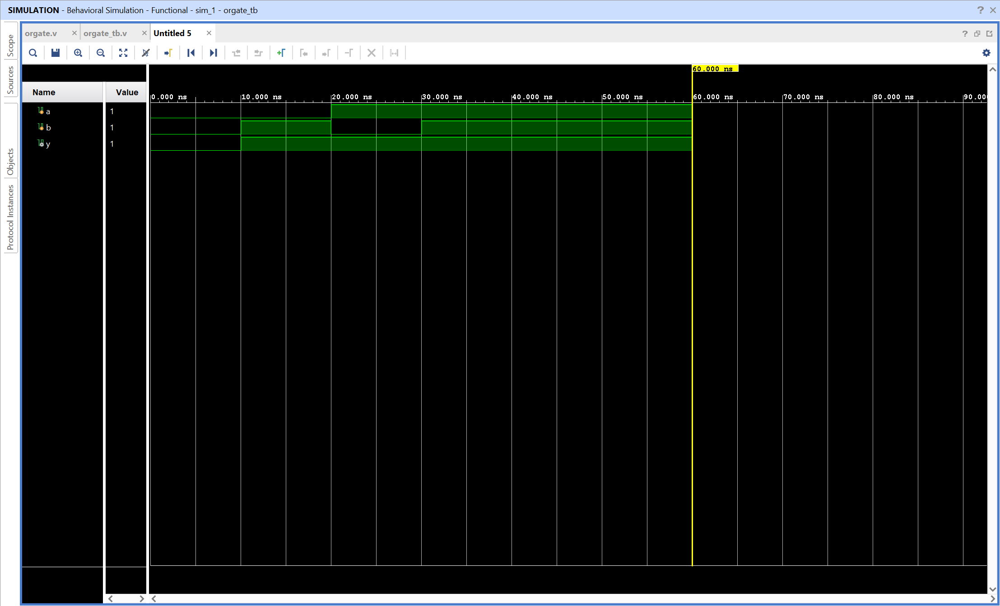

# OR Gate - Verilog Implementation

## Objective

Design and simulate an OR gate using Verilog in AMD Vivado.
The circuit performs a logical OR operation on two binary inputs.

## OR Gate

An OR gate is a basic combinational logic gate that outputs 1 when at least one input is 1.

Inputs
A, B

Output
Y

Logic equation

Y = A | B

The output is low only when both inputs are low. For all other input combinations, the output is high.

## Truth Table

| A   | B   | Y = A OR B |
| --- | --- | ---------- |
| 0   | 0   | 0          |
| 0   | 1   | 1          |
| 1   | 0   | 1          |
| 1   | 1   | 1          |

## Files

orgate.v - Verilog design module implementing OR logic
orgate_tb.v - Testbench used for simulation

## RTL Schematic

The RTL schematic shows a single logical operation block connecting inputs **a** and **b** to output **y**.

Vivado represents the OR operation using an RTL block internally, but the behavior corresponds to OR logic as defined in the code.

Both inputs feed into the block, and the output becomes high when either input is high.

## Simulation Waveform

The waveform verifies the OR gate behavior over time.

Inputs **a** and **b** are toggled by the testbench.
The output **y** changes according to the OR logic.

Observations:

- When both inputs are 0, output remains 0
- When either input is 1, output becomes 1

This confirms correct functionality of the OR gate.
