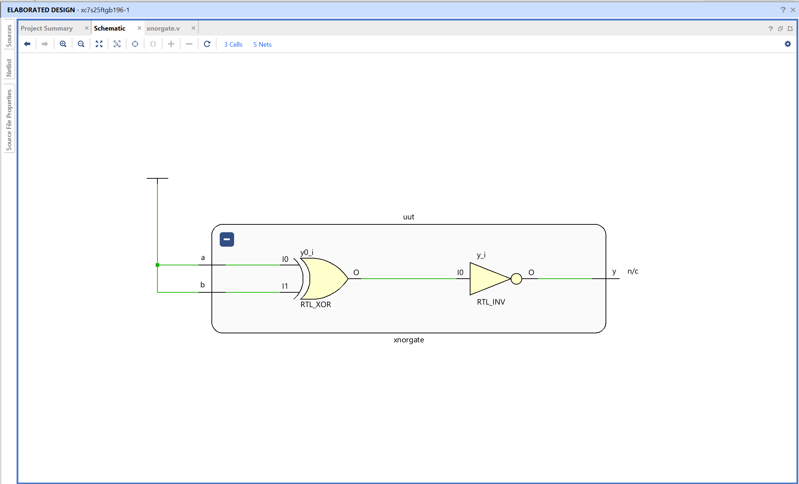
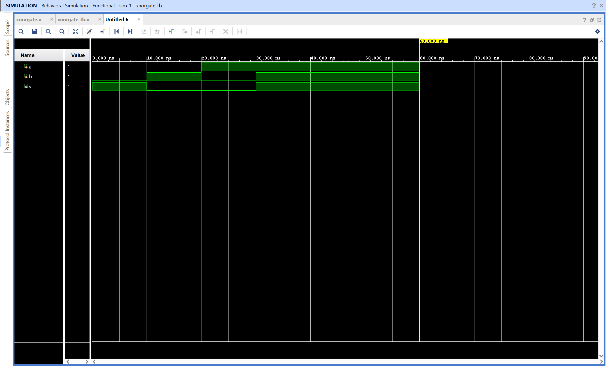

# XNOR Gate - Verilog Implementation

## Objective

Design and simulate an XNOR gate using Verilog in AMD Vivado.
The circuit performs an inverted XOR operation on two binary inputs.

## XNOR Gate

An XNOR gate is a basic combinational logic gate that outputs 1 when both inputs have the same value.

Inputs
A, B

Output
Y

Logic equation

Y = ~(A ^ B)

The output is high when both inputs are equal and low when the inputs are different.

## Truth Table

| A   | B   | Y = ~(A ^ B) |
| --- | --- | ------------ |
| 0   | 0   | 1            |
| 0   | 1   | 0            |
| 1   | 0   | 0            |
| 1   | 1   | 1            |

## Files

xnorgate.v - Verilog design module implementing XNOR logic
xnorgate_tb.v - Testbench used for simulation

## RTL Schematic

The RTL schematic shows a single logical operation block connecting inputs **a** and **b** to output **y**.

Vivado represents the XNOR operation using an RTL block internally, but the behavior corresponds to XNOR logic as defined in the code.

The output is high when both inputs match and low when they differ.

## Simulation Waveform

The waveform verifies the XNOR gate behavior over time.

Inputs **a** and **b** are toggled by the testbench.
The output **y** changes according to the XNOR logic.

Observations:

- When both inputs are equal, output becomes 1
- When the inputs are different, output becomes 0

This confirms correct functionality of the XNOR gate.
