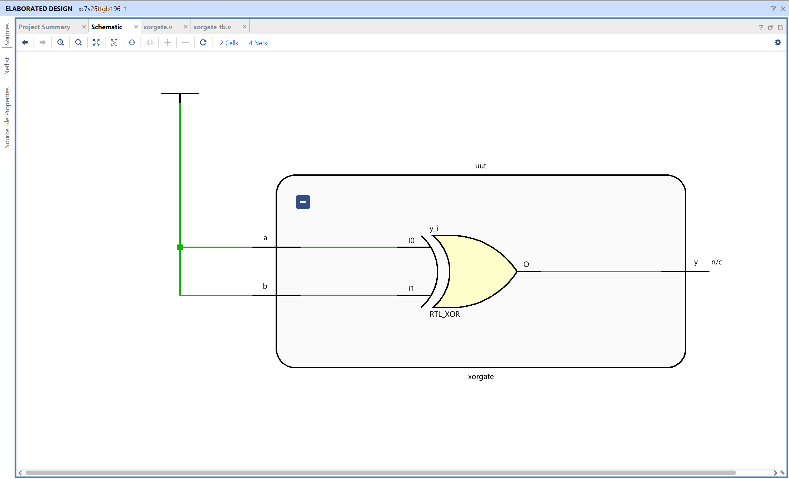
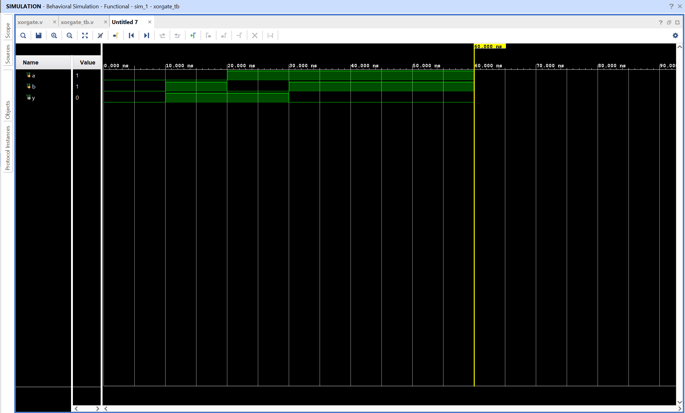

# XOR Gate - Verilog Implementation

## Objective

Design and simulate an XOR gate using Verilog in AMD Vivado.
The circuit performs an exclusive-OR operation on two binary inputs.

## XOR Gate

An XOR gate is a basic combinational logic gate that outputs 1 when the two inputs have different values.

Inputs
A, B

Output
Y

Logic equation

Y = A ^ B

The output is high when the inputs are different and low when both inputs have the same value.

## Truth Table

| A   | B   | Y = A ^ B |
| --- | --- | --------- |
| 0   | 0   | 0         |
| 0   | 1   | 1         |
| 1   | 0   | 1         |
| 1   | 1   | 0         |

## Files

xorgate.v - Verilog design module implementing XOR logic
xorgate_tb.v - Testbench used for simulation

## RTL Schematic

The RTL schematic shows a single logical operation block connecting inputs **a** and **b** to output **y**.

Vivado represents the XOR operation using an RTL block internally, but the behavior corresponds to XOR logic as defined in the code.

The output is high when exactly one of the inputs is high.

## Simulation Waveform

The waveform verifies the XOR gate behavior over time.

Inputs **a** and **b** are toggled by the testbench.
The output **y** changes according to the XOR logic.

Observations:

- When both inputs are equal, output remains 0
- When exactly one input is 1, output becomes 1

This confirms correct functionality of the XOR gate.
