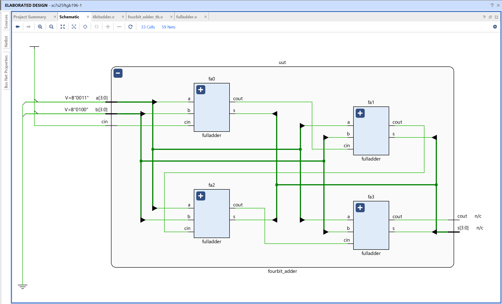
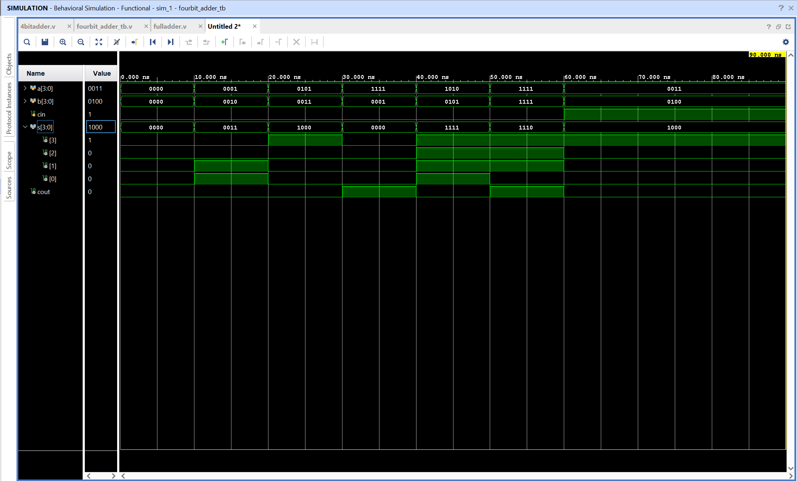

# 4-Bit Ripple-Carry Adder - Verilog Implementation

## Objective

Design and simulate a 4-bit binary adder using Verilog in AMD Vivado.
The circuit adds two 4-bit binary numbers and an optional input carry, producing a 4-bit sum and a final carry output.

## What Is a 4-Bit Adder?

A 4-bit adder adds two binary values, `A` and `B`, where each value contains four bits:

```text
A = A[3] A[2] A[1] A[0]
B = B[3] B[2] B[1] B[0]
```

Bit 0 is the least significant bit (LSB), and bit 3 is the most significant bit (MSB). The circuit also accepts `cin`, an input carry from a previous addition. Its outputs are:

- `s[3:0]`: the four-bit sum
- `cout`: the carry generated beyond the most significant bit

The complete result is therefore five bits wide:

```text
{cout, s[3:0]} = A + B + cin
```

The braces indicate concatenation. The final carry is placed to the left of the four sum bits so that it is not lost when the addition is larger than four bits can represent.

## Why Are Four Full Adders Used?

A full adder adds three one-bit values:

1. One bit from the first operand
2. One bit from the second operand
3. The carry produced by the previous bit position

Since each input number has four bit positions, the design needs one full adder for each position. A single full adder can only process one pair of bits, so four full adders are connected together to process all four pairs:

| Full adder | Operands processed | Input carry | Sum output | Output carry |
| ---------- | ------------------ | ----------- | ---------- | ------------ |
| `fa0`      | `a[0]`, `b[0]`     | `cin`       | `s[0]`     | `c1`         |
| `fa1`      | `a[1]`, `b[1]`     | `c1`        | `s[1]`     | `c2`         |
| `fa2`      | `a[2]`, `b[2]`     | `c2`        | `s[2]`     | `c3`         |
| `fa3`      | `a[3]`, `b[3]`     | `c3`        | `s[3]`     | `cout`       |

The least significant stage, `fa0`, receives the external `cin`. Each later stage receives the carry generated by the stage before it. This is why all four stages are full adders, including the first one: the least significant bit may also need to add an incoming carry.

## Ripple-Carry Operation

The carry moves, or ripples, from the least significant bit toward the most significant bit:

```text
cin -> fa0 -> c1 -> fa1 -> c2 -> fa2 -> c3 -> fa3 -> cout
```

For example, when adding `1111` and `0001` with `cin = 0`:

```text
	 1 1 1 1
 + 0 0 0 1
 ---------
 1 0 0 0 0
```

The addition begins at bit 0. The carry generated there must reach bit 1, then bit 2, then bit 3. The final carry from bit 3 becomes `cout`, while the four remaining result bits become `s[3:0]`.

This design is called a ripple-carry adder because each stage waits for the carry from the previous stage. It is simple and easy to understand, although larger adders can use faster carry-lookahead techniques to reduce the delay caused by this chain.

## Logic Equations

Each full adder uses the following equations for its sum and carry:

```text
sum = a_bit ^ b_bit ^ carry_in
carry_out = (a_bit & b_bit) | (b_bit & carry_in) | (a_bit & carry_in)
```

The `fourbit_adder` module reuses these full-adder equations four times, once for each bit position. The `fulladder.v` module provides the reusable one-bit building block.

## Module Interface

| Signal | Width | Direction | Description                                |
| ------ | ----- | --------- | ------------------------------------------ |
| `a`    | 4     | Input     | First 4-bit binary operand                 |
| `b`    | 4     | Input     | Second 4-bit binary operand                |
| `cin`  | 1     | Input     | Carry input to the least significant stage |
| `s`    | 4     | Output    | Four-bit sum                               |
| `cout` | 1     | Output    | Final carry beyond bit 3                   |

## Test Cases and Output Interpretation

The testbench applies several additions to verify ordinary sums, carry propagation, overflow beyond four bits, and the use of `cin`.

| A    | B    | Cin | Expected complete result | `cout` | `s`  |
| ---- | ---- | --- | ------------------------ | ------ | ---- |
| 0000 | 0000 | 0   | 00000                    | 0      | 0000 |
| 0001 | 0010 | 0   | 00011                    | 0      | 0011 |
| 0101 | 0011 | 0   | 01000                    | 0      | 1000 |
| 1111 | 0001 | 0   | 10000                    | 1      | 0000 |
| 1010 | 0101 | 0   | 01111                    | 0      | 1111 |
| 1111 | 1111 | 0   | 11110                    | 1      | 1110 |
| 0011 | 0100 | 1   | 01000                    | 0      | 1000 |

For example, `1111 + 0001 = 10000`. A four-bit output alone could only show `0000`, so `cout = 1` is required to preserve the fifth result bit. Likewise, the final test case calculates `0011 + 0100 + 1 = 1000`, showing that `cin` is included in the addition.

## Files

4bitadder.v - Top-level Verilog module connecting four full adders
4bitadder_tb.v - Testbench used to simulate the 4-bit adder
fulladder.v - Reusable one-bit full adder module used by the design

## RTL Schematic



The RTL schematic shows the four full-adder stages and the carry connections between them. The first stage receives `cin`, and the last stage produces `cout`.

## Simulation Waveform



The waveform verifies the output for each testbench input combination. The four sum bits represent the result within the 4-bit range, while `cout` records any carry beyond that range.

Observations:

- Carries propagate from the least significant stage to the most significant stage
- `cout` becomes 1 when the total is greater than 15
- The input carry `cin` changes the final result by one
- The combined output `{cout, s}` represents the complete binary addition

This confirms the correct functionality of the 4-bit ripple-carry adder.
