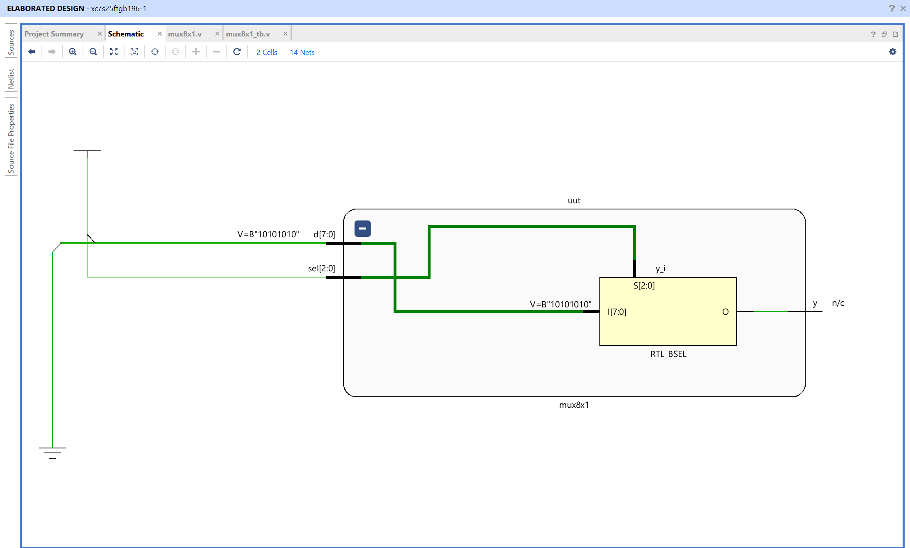
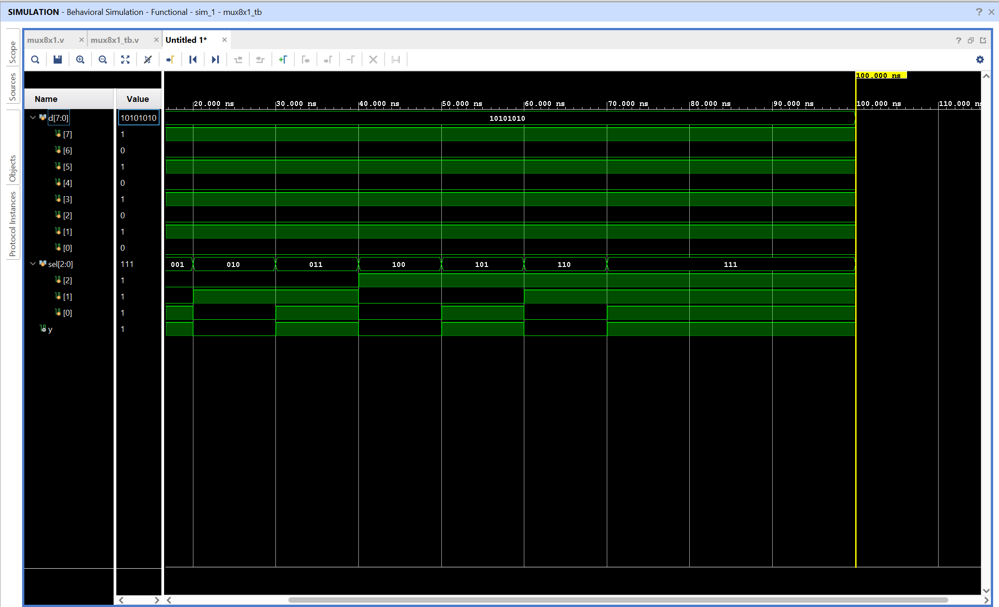

# 8-to-1 Multiplexer - Verilog Implementation

## Objective

Design and simulate an 8-to-1 multiplexer using Verilog in AMD Vivado.
The circuit selects one of eight input data bits and routes the selected bit to a single output.

## What Is a Multiplexer?

A multiplexer, or MUX, is a combinational circuit that selects one input from several available inputs. The selected input is determined by the select lines.

This design is an 8-to-1 multiplexer, so it has:

- Eight data inputs contained in the bus `d[7:0]`
- Three select inputs contained in `sel[2:0]`
- One output, `y`

Three select bits can represent eight different binary values because $2^3 = 8$. Each select value corresponds to one data-bit position.

## How the Selection Works

The Verilog implementation is:

```verilog
assign y = d[sel];
```

The selector is used as an index into the data bus. The selected bit is continuously assigned to `y`, so the output changes whenever either `d` or `sel` changes.

| `sel` | Selected input | Output     |
| ----- | -------------- | ---------- |
| 000   | `d[0]`         | `y = d[0]` |
| 001   | `d[1]`         | `y = d[1]` |
| 010   | `d[2]`         | `y = d[2]` |
| 011   | `d[3]`         | `y = d[3]` |
| 100   | `d[4]`         | `y = d[4]` |
| 101   | `d[5]`         | `y = d[5]` |
| 110   | `d[6]`         | `y = d[6]` |
| 111   | `d[7]`         | `y = d[7]` |

The data bus is declared as `[7:0]`, where `d[7]` is the most significant bit and `d[0]` is the least significant bit. Therefore, the written binary value `10101010` maps as follows:

```text
d[7] d[6] d[5] d[4] d[3] d[2] d[1] d[0]
	1    0    1    0    1    0    1    0
```

For example, when `sel = 3'b001`, the circuit selects `d[1]`, which is 1 for this data pattern, so `y = 1`.

## Truth Table

The complete output depends on the selected data bit. The selector portion of the truth table is:

| Select value | Data bit passed to output |
| ------------ | ------------------------- |
| 000          | `y = d[0]`                |
| 001          | `y = d[1]`                |
| 010          | `y = d[2]`                |
| 011          | `y = d[3]`                |
| 100          | `y = d[4]`                |
| 101          | `y = d[5]`                |
| 110          | `y = d[6]`                |
| 111          | `y = d[7]`                |

Unlike a logic gate, the multiplexer does not produce a fixed output for a selector value. It forwards whichever 0 or 1 is currently present on the selected data input.

## Testbench Behavior

The testbench sets the data bus to:

```text
d = 8'b10101010
```

It then applies every select value from `000` to `111`. The expected output sequence is:

| `sel` | Selected bit | Expected `y` |
| ----- | ------------ | ------------ |
| 000   | `d[0] = 0`   | 0            |
| 001   | `d[1] = 1`   | 1            |
| 010   | `d[2] = 0`   | 0            |
| 011   | `d[3] = 1`   | 1            |
| 100   | `d[4] = 0`   | 0            |
| 101   | `d[5] = 1`   | 1            |
| 110   | `d[6] = 0`   | 0            |
| 111   | `d[7] = 1`   | 1            |

The output sequence is therefore `0, 1, 0, 1, 0, 1, 0, 1` as the selector advances.

## Module Interface

| Signal | Width | Direction | Description                        |
| ------ | ----- | --------- | ---------------------------------- |
| `d`    | 8     | Input     | Eight-bit data input bus           |
| `sel`  | 3     | Input     | Selects one of the eight data bits |
| `y`    | 1     | Output    | Selected data bit                  |

## Files

mux.v - Verilog design module implementing the 8-to-1 multiplexer
mux_tb.v - Testbench used to simulate all select values

## RTL Schematic



The RTL schematic shows the data bus, selector bus, and output connection for the 8-to-1 multiplexer.

## Simulation Waveform



The waveform verifies that each select value routes the corresponding bit from `d` to `y`. Since the data bus remains `10101010` during the test, the output follows the alternating bit pattern as `sel` changes.

Observations:

- `sel = 000` selects the least significant bit, `d[0]`
- `sel = 111` selects the most significant bit, `d[7]`
- Every one of the eight data bits is selected once
- The output always matches the currently selected data bit

This confirms correct functionality of the 8-to-1 multiplexer.
