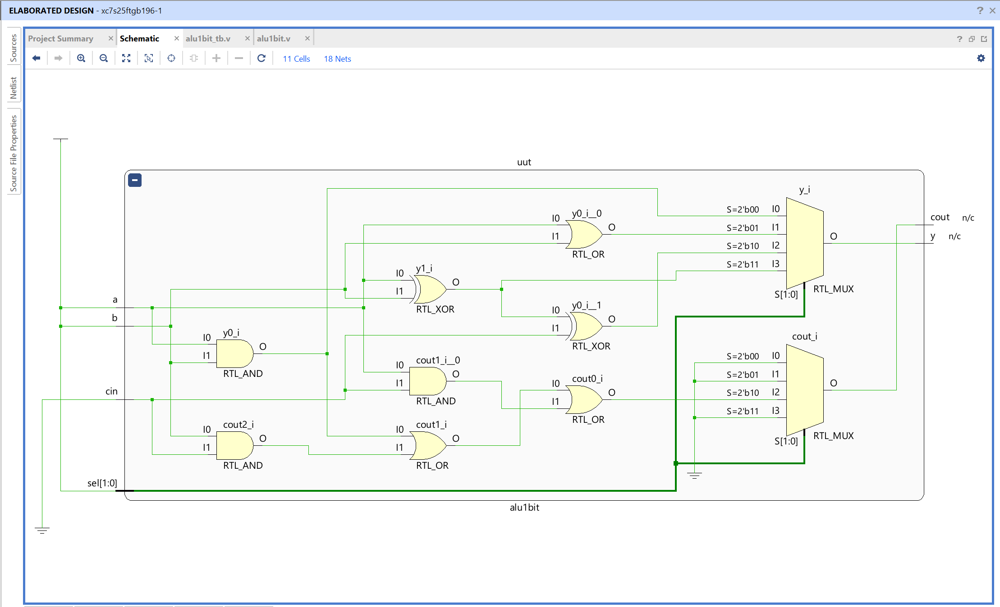
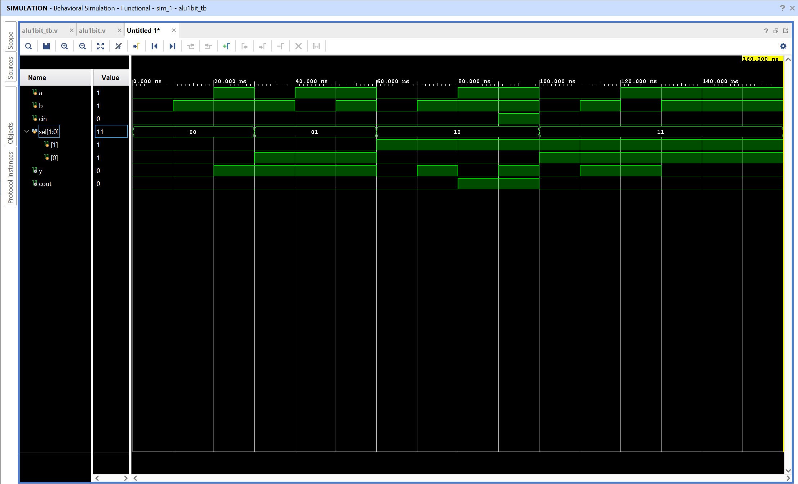

# 1-Bit Arithmetic Logic Unit - Verilog Implementation

## Objective

Design and simulate a 1-bit arithmetic logic unit (ALU) using Verilog in AMD Vivado.
The circuit performs several logical and arithmetic operations on two one-bit inputs. A 2-bit select signal chooses which operation is active.

## What Is an ALU?

An arithmetic logic unit is a combinational circuit that performs operations selected by control signals. ALUs are core building blocks in processors, calculators, digital controllers, and other computing systems.

This project implements a small 1-bit ALU. It combines three kinds of logic in one module:

- Logical AND
- Logical OR
- Full-adder addition
- Exclusive OR (XOR)

The input signals `a` and `b` are the one-bit operands. The `cin` input is used as the carry-in for the addition operation. The `sel` control signal determines which operation drives the output `y`.

## High-Level Operation

The ALU receives the same operands for every operation, but only the operation selected by `sel` affects the output:

```text
             +----------------+
 a -------->|                |
 b -------->|   1-Bit ALU   |----> y
 cin ------>|                |----> cout
 sel ------>|  Operation     |
             |  Selection     |
             +----------------+
```

The output `y` is the result of the selected operation. The output `cout` is meaningful for addition because it stores the carry produced by the full-adder logic. For the logical operations, `cout` is explicitly set to 0.

## Operation Selection

The 2-bit `sel` signal provides four possible operation codes:

| `sel` | Operation | Output equation   | Meaning of `cout`       |
| ----- | --------- | ----------------- | ----------------------- | -------- |
| 00    | AND       | `y = a & b`       | Always 0                |
| 01    | OR        | `y = a            | b`                      | Always 0 |
| 10    | ADD       | `y = a ^ b ^ cin` | Carry-out from addition |
| 11    | XOR       | `y = a ^ b`       | Always 0                |

The Verilog `case(sel)` statement acts as the ALU's control decoder. When the select value changes, the corresponding operation is evaluated and assigned to the outputs.

## Operation 1: AND

When `sel = 2'b00`, the ALU performs a bitwise AND operation:

```text
y = a & b
cout = 0
```

The result is 1 only when both operands are 1.

| A   | B   | Y   |
| --- | --- | --- |
| 0   | 0   | 0   |
| 0   | 1   | 0   |
| 1   | 0   | 0   |
| 1   | 1   | 1   |

The carry-in `cin` does not affect the AND operation.

## Operation 2: OR

When `sel = 2'b01`, the ALU performs a bitwise OR operation:

```text
y = a | b
cout = 0
```

The result is 1 when at least one operand is 1.

| A   | B   | Y   |
| --- | --- | --- |
| 0   | 0   | 0   |
| 0   | 1   | 1   |
| 1   | 0   | 1   |
| 1   | 1   | 1   |

The carry-in `cin` does not affect the OR operation.

## Operation 3: Addition

When `sel = 2'b10`, the ALU behaves as a one-bit full adder:

```text
y = a ^ b ^ cin
cout = (a & b) | (b & cin) | (a & cin)
```

Here, `y` is the sum bit and `cout` is the carry-out bit. Together, `{cout, y}` represent the complete two-bit result of adding the three one-bit values:

```text
{cout, y} = a + b + cin
```

| A   | B   | Cin | Y (sum) | Cout |
| --- | --- | --- | ------- | ---- |
| 0   | 0   | 0   | 0       | 0    |
| 0   | 0   | 1   | 1       | 0    |
| 0   | 1   | 0   | 1       | 0    |
| 0   | 1   | 1   | 0       | 1    |
| 1   | 0   | 0   | 1       | 0    |
| 1   | 0   | 1   | 0       | 1    |
| 1   | 1   | 0   | 0       | 1    |
| 1   | 1   | 1   | 1       | 1    |

For example, when `a = 1`, `b = 1`, and `cin = 1`, the total is 3, or binary `11`. Therefore, `y = 1` and `cout = 1`.

The addition operation is the only operation in this ALU that produces a meaningful carry-out. This makes the one-bit ALU suitable for connecting to other one-bit ALU stages to build a wider arithmetic unit.

## Operation 4: XOR

When `sel = 2'b11`, the ALU performs an exclusive OR operation:

```text
y = a ^ b
cout = 0
```

The result is 1 when the operands are different and 0 when they are equal.

| A   | B   | Y   |
| --- | --- | --- |
| 0   | 0   | 0   |
| 0   | 1   | 1   |
| 1   | 0   | 1   |
| 1   | 1   | 0   |

The carry-in `cin` does not affect the XOR operation.

## Why `cout` Is Reset for Logic Operations

The module begins every combinational evaluation with:

```verilog
cout = 0;
```

The `cout` signal is then changed only inside the ADD case. This ensures that AND, OR, and XOR do not accidentally retain a carry value from a previous addition operation. Without this default assignment, simulation could show an incorrect or stale carry output when the select signal changes from ADD to a logical operation.

## Combinational Behavior

The ALU uses an `always @(*)` block, which describes combinational logic. The sensitivity list `(*)` causes the block to reevaluate whenever any input used inside the block changes:

- `a`
- `b`
- `cin`
- `sel`

There is no clock and no stored state. The outputs respond to the current inputs and select code. In a physical circuit, the output changes after the small propagation delay of the gates; in the Verilog simulation, the behavioral result is recalculated whenever an input changes.

Both `y` and `cout` are declared as `reg` because they are assigned inside the procedural `always` block. This does not mean they are storage elements; the complete combinational assignment keeps the intended behavior combinational.

## Module Interface

| Signal | Width | Direction | Description                               |
| ------ | ----- | --------- | ----------------------------------------- |
| `a`    | 1     | Input     | First one-bit operand                     |
| `b`    | 1     | Input     | Second one-bit operand                    |
| `cin`  | 1     | Input     | Carry input used by ADD                   |
| `sel`  | 2     | Input     | Selects the ALU operation                 |
| `y`    | 1     | Output    | Result of the selected operation          |
| `cout` | 1     | Output    | Carry-out for ADD; 0 for logic operations |

## Testbench Coverage

The testbench applies representative cases for each operation:

### AND tests

```text
sel = 00
(a, b) = (0, 0), (0, 1), (1, 1)
```

These cases verify zero results when one or both inputs are 0 and a high result when both inputs are 1.

### OR tests

```text
sel = 01
(a, b) = (0, 1), (1, 0), (1, 1)
```

These cases verify that either high input produces a high output.

### ADD tests

```text
sel = 10
(a, b, cin) = (0, 0, 0), (0, 1, 0), (1, 1, 0), (1, 1, 1)
```

These cases cover zero, a sum without carry, a carry from `1 + 1`, and the maximum one-bit full-adder input `1 + 1 + 1`.

### XOR tests

```text
sel = 11
(a, b) = (0, 0), (0, 1), (1, 0), (1, 1)
```

These cases cover all possible combinations for the XOR operation.

## Files

alu1bit.v - Verilog design module implementing the 1-bit ALU
alu1bit_tb.v - Testbench used to verify the four ALU operations

## RTL Schematic



The RTL schematic shows the combinational logic used to implement the selected AND, OR, ADD, and XOR operations and to generate the result and carry outputs.

## Simulation Waveform



The waveform verifies the ALU behavior for the testbench cases. The `sel` signal changes the active operation, `y` shows the selected result, and `cout` becomes high only for addition cases that produce a carry.

Observations:

- `sel = 00` produces the AND result
- `sel = 01` produces the OR result
- `sel = 10` produces the full-adder sum and carry
- `sel = 11` produces the XOR result
- `cout` is 0 for logical operations
- `cout` is meaningful only during the ADD operation

This confirms the intended functionality of the 1-bit arithmetic logic unit.
