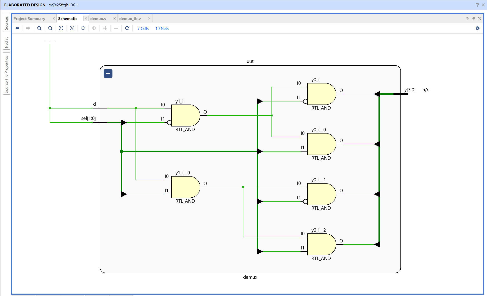
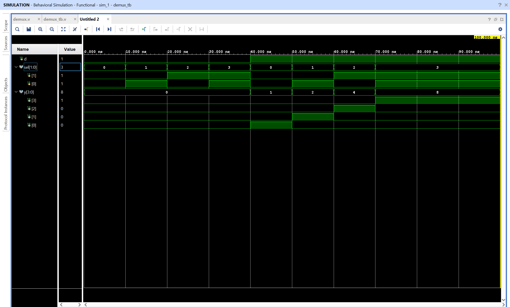

# 1-to-4 Demultiplexer - Verilog Implementation

## Objective

Design and simulate a 1-to-4 demultiplexer using Verilog in AMD Vivado.
The circuit routes one data input to exactly one of four outputs according to the select lines.

## What Is a Demultiplexer?

A demultiplexer, or DEMUX, performs the opposite basic routing function of a multiplexer. A multiplexer selects one of many inputs and sends it to one output. A demultiplexer accepts one input and sends it to one selected output.

This design has:

- One data input, `d`
- Two select inputs, `sel[1:0]`
- Four outputs, `y[3:0]`

Two select bits can represent four different binary values because $2^2 = 4$. Each selector value activates one output path.

## How the Selection Works

The selector chooses which output receives the data input:

| `sel` | Selected output | Result when `d = 1` |
| ----- | --------------- | ------------------- |
| 00    | `y[0]`          | `y = 0001`          |
| 01    | `y[1]`          | `y = 0010`          |
| 10    | `y[2]`          | `y = 0100`          |
| 11    | `y[3]`          | `y = 1000`          |

When `d = 1`, the selected output becomes 1 and all other outputs remain 0. When `d = 0`, every output remains 0 regardless of the selector value.

## Logic Equations

Each output is enabled by one selector combination:

```text
y[0] = d & ~sel[1] & ~sel[0]
y[1] = d & ~sel[1] &  sel[0]
y[2] = d &  sel[1] & ~sel[0]
y[3] = d &  sel[1] &  sel[0]
```

The selector terms act like enable conditions. For example, `y[2]` can become high only when `sel = 2'b10` and `d = 1`.

## Truth Table

| `d` | `sel` | `y[3:0]` | Active output |
| --- | ----- | -------- | ------------- |
| 0   | 00    | 0000     | None          |
| 0   | 01    | 0000     | None          |
| 0   | 10    | 0000     | None          |
| 0   | 11    | 0000     | None          |
| 1   | 00    | 0001     | `y[0]`        |
| 1   | 01    | 0010     | `y[1]`        |
| 1   | 10    | 0100     | `y[2]`        |
| 1   | 11    | 1000     | `y[3]`        |

The output vector is written as `y[3:0]`, so `y[3]` is the leftmost bit and `y[0]` is the rightmost bit. For example, `y = 0100` means that only `y[2]` is high.

## Module Interface

| Signal | Width | Direction | Description                     |
| ------ | ----- | --------- | ------------------------------- |
| `d`    | 1     | Input     | Data value to route             |
| `sel`  | 2     | Input     | Selects one of the four outputs |
| `y`    | 4     | Output    | One-hot routed output vector    |

## Testbench Behavior

The testbench first sets `d = 0` and cycles through all four selector values. This confirms that no output becomes high when the data input is low.

It then sets `d = 1` and cycles through the same selector values. This confirms that the high input is routed to `y[0]`, `y[1]`, `y[2]`, and `y[3]` in sequence.

The expected output sequence for `d = 1` is:

```text
sel = 00 -> y = 0001
sel = 01 -> y = 0010
sel = 10 -> y = 0100
sel = 11 -> y = 1000
```

## Files

demux.v - Verilog design module implementing the 1-to-4 demultiplexer
demux_tb.v - Testbench used to verify all data and selector combinations

## RTL Schematic



The RTL schematic shows the selector-controlled logic paths from input **d** to the four outputs **y[3:0]**.

## Simulation Waveform



The waveform verifies both operating conditions. During the first part of the simulation, `d = 0` keeps all outputs low. During the second part, `d = 1` causes the selected output to become high while the other three outputs remain low.

Observations:

- Only one output is selected for each valid selector value
- When `d = 0`, all outputs are 0
- When `d = 1`, the output pattern is one-hot
- Changing `sel` moves the high output to a different position

This confirms correct functionality of the 1-to-4 demultiplexer.
