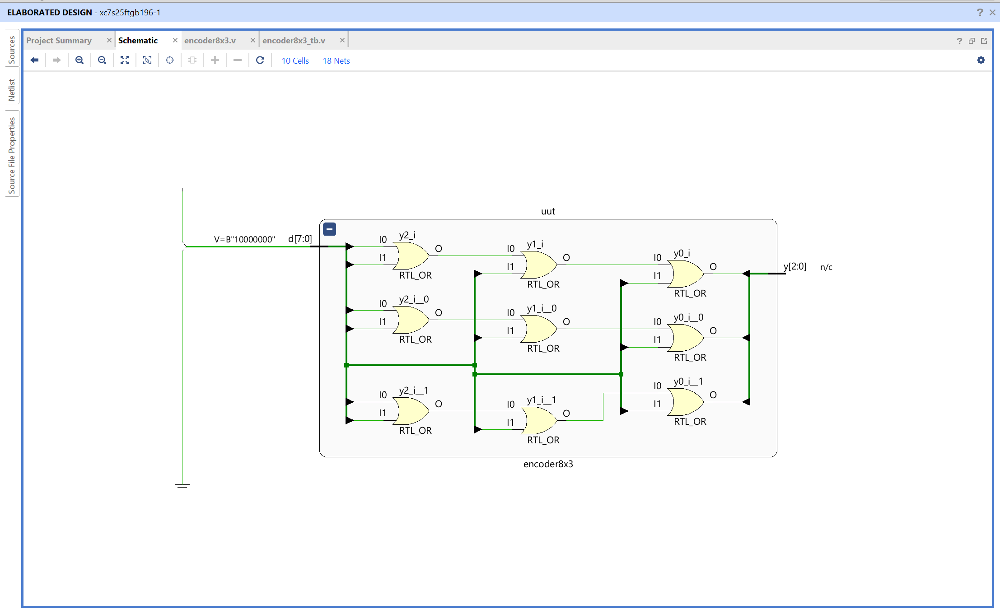
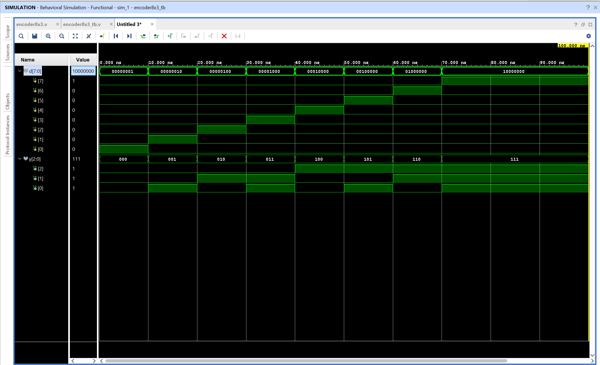

# 8-to-3 Encoder - Verilog Implementation

## Objective

Design and simulate an 8-to-3 binary encoder using Verilog in AMD Vivado.
The circuit converts one active input out of eight into the corresponding 3-bit binary code.

## What Is an Encoder?

An encoder is a combinational circuit that converts one active input line into a smaller binary representation. This design has eight input lines and three output lines.

The input bus `d[7:0]` is expected to be one-hot, meaning exactly one input bit is 1 at a time. The output bus `y[2:0]` identifies which input is active:

```text
Active input d[n] -> Binary output y = n
```

Three output bits are sufficient to represent eight input positions because $2^3 = 8$.

## Input and Output Mapping

| Active input | `d[7:0]` | Output `y[2:0]` |
| ------------ | -------- | --------------- |
| `d[0]`       | 00000001 | 000             |
| `d[1]`       | 00000010 | 001             |
| `d[2]`       | 00000100 | 010             |
| `d[3]`       | 00001000 | 011             |
| `d[4]`       | 00010000 | 100             |
| `d[5]`       | 00100000 | 101             |
| `d[6]`       | 01000000 | 110             |
| `d[7]`       | 10000000 | 111             |

For example, if `d = 8'b00100000`, then `d[5]` is the active input. The encoder produces `y = 3'b101`, which is the binary representation of decimal 5.

## Logic Equations

The output bits are formed by ORing the input lines that require each binary output bit to be high:

```text
y[2] = d[4] | d[5] | d[6] | d[7]
y[1] = d[2] | d[3] | d[6] | d[7]
y[0] = d[1] | d[3] | d[5] | d[7]
```

The most significant output bit, `y[2]`, is high for input positions 4 through 7. The middle bit, `y[1]`, is high for positions 2, 3, 6, and 7. The least significant bit, `y[0]`, is high for the odd-numbered input positions.

## Truth Table

For a standard encoder, the valid input condition is one active input at a time:

| `d[7:0]` | `y[2:0]` | Meaning           |
| -------- | -------- | ----------------- |
| 00000001 | 000      | Input 0 is active |
| 00000010 | 001      | Input 1 is active |
| 00000100 | 010      | Input 2 is active |
| 00001000 | 011      | Input 3 is active |
| 00010000 | 100      | Input 4 is active |
| 00100000 | 101      | Input 5 is active |
| 01000000 | 110      | Input 6 is active |
| 10000000 | 111      | Input 7 is active |

The design does not include a valid or priority output. Therefore, if no input is active, the output is `000`, which is indistinguishable from the code for `d[0]`. If multiple inputs are high at the same time, the OR equations can produce a code that does not uniquely identify one input. The circuit should therefore be used with one-hot input data.

## Module Interface

| Signal | Width | Direction | Description                      |
| ------ | ----- | --------- | -------------------------------- |
| `d`    | 8     | Input     | One-hot input bus                |
| `y`    | 3     | Output    | Binary code for the active input |

## Testbench Behavior

The testbench applies the eight valid one-hot patterns in order:

```text
00000001, 00000010, 00000100, 00001000,
00010000, 00100000, 01000000, 10000000
```

The expected output counts upward from `000` to `111`. This verifies that every input position is correctly converted into its corresponding binary index.

## Files

encoder8x3.v - Verilog design module implementing the 8-to-3 encoder
encoder_tb8x3.v - Testbench used to verify all one-hot input patterns

## RTL Schematic



The RTL schematic shows the OR logic used to generate the three output bits from the eight input lines.

## Simulation Waveform



The waveform verifies that each one-hot input pattern produces the correct 3-bit binary code. As the active input moves from `d[0]` to `d[7]`, the output changes from `000` to `111`.

Observations:

- Each valid input pattern has exactly one active input bit
- `d[0]` produces output `000`
- `d[7]` produces output `111`
- Every input position is represented by its binary index

This confirms correct functionality of the 8-to-3 encoder.
