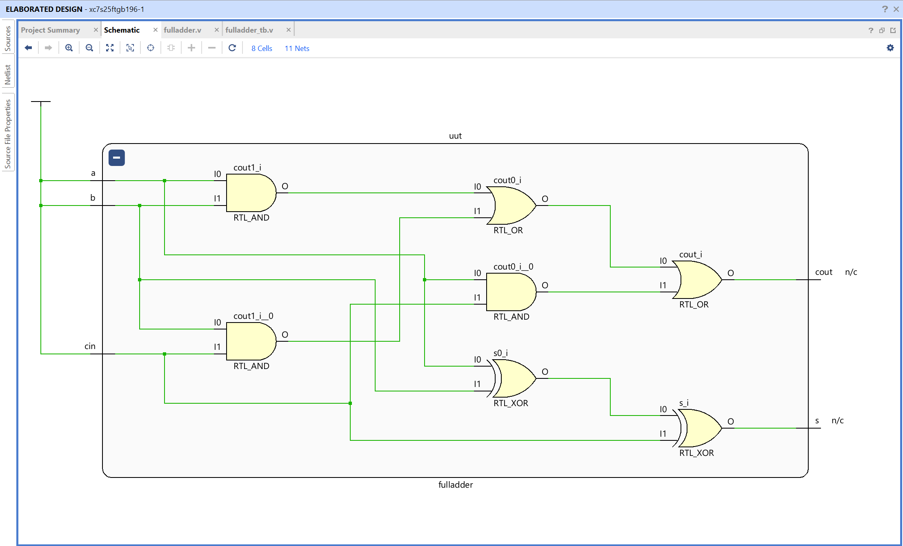
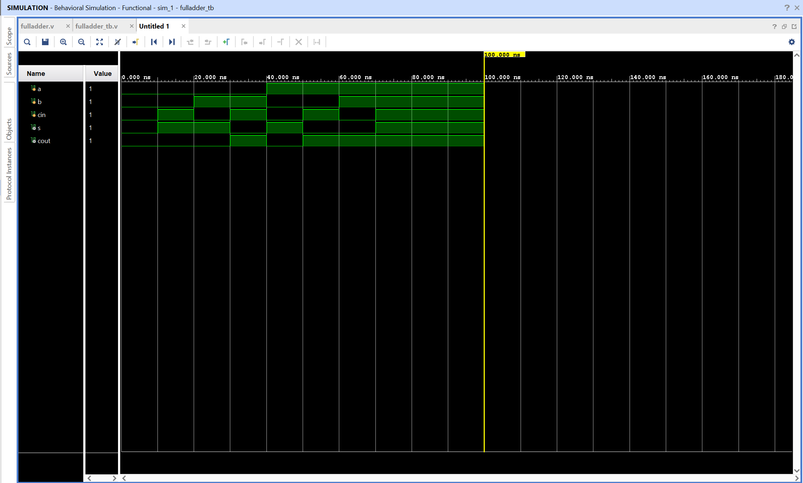

# Full Adder - Verilog Implementation

## Objective

Design and simulate a full adder using Verilog in AMD Vivado.
The circuit adds two binary inputs and an input carry, producing a sum and an output carry.

## Full Adder

A full adder is a combinational circuit that adds three one-bit inputs: two operand bits and an input carry bit.

Inputs
A, B, Cin

Outputs
S, Cout

Logic equations

S = A ^ B ^ Cin

Cout = (A & B) | (B & Cin) | (A & Cin)

The sum output represents the least significant bit of the addition, while the carry output represents the carry to the next bit position.

## Truth Table

| A   | B   | Cin | S   | Cout |
| --- | --- | --- | --- | ---- |
| 0   | 0   | 0   | 0   | 0    |
| 0   | 0   | 1   | 1   | 0    |
| 0   | 1   | 0   | 1   | 0    |
| 0   | 1   | 1   | 0   | 1    |
| 1   | 0   | 0   | 1   | 0    |
| 1   | 0   | 1   | 0   | 1    |
| 1   | 1   | 0   | 0   | 1    |
| 1   | 1   | 1   | 1   | 1    |

## Files

fulladder.v - Verilog design module implementing full adder logic
fulladder_tb.v - Testbench used for simulation

## RTL Schematic

The RTL schematic shows the combinational logic connecting inputs **a**, **b**, and **cin** to sum output **s** and carry output **cout**.

Vivado represents the full adder using XOR, AND, and OR logic internally, matching the equations defined in the Verilog module.

## Simulation Waveform

The waveform verifies the full adder behavior over time.

Inputs **a**, **b**, and **cin** are toggled through all possible combinations by the testbench.
The outputs **s** and **cout** change according to the full adder logic.

Observations:

- The sum output is 1 when an odd number of inputs are 1
- The carry output is 1 when at least two inputs are 1
- When all three inputs are 1, both sum and carry outputs are 1

This confirms correct functionality of the full adder.
