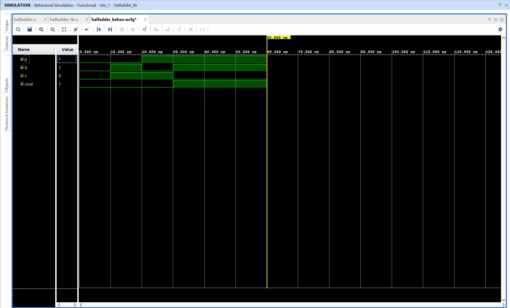
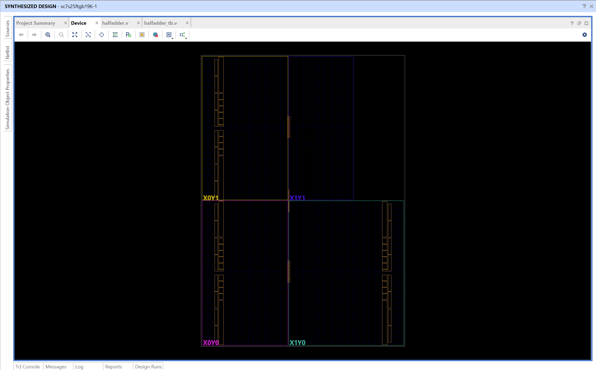

# Half Adder – Verilog Implementation

## Objective
Design and simulate a Half Adder using Verilog in AMD Vivado.  
The circuit performs binary addition of two single bit inputs and produces a Sum and Carry output.

## Half Adder
A Half Adder is a combinational logic circuit that adds two 1 bit binary inputs.

**Inputs:**
A, B

**Outputs**:
Sum (S) and Carry (Cout)

**Logic equations**:

S = A ⊕ B  
Cout = A · B

->The XOR gate generates the Sum output because the result is 1 only when the inputs are different.  
-> The AND gate generates the Carry output because a carry occurs only when both inputs are 1.

## Truth Table

| A | B | Sum (S) | Carry (Cout) |
|---|---|---|---|
| 0 | 0 | 0 | 0 |
| 0 | 1 | 1 | 0 |
| 1 | 0 | 1 | 0 |
| 1 | 1 | 0 | 1 |

## Files
halfadder.v – Verilog code implementing half adder.

halfadder_tb.v – Testbench to simulate and verify the implementation.

## RTL Schematic

The RTL schematic generated by Vivado shows the logical structure of the design.  
Input signals **a** and **b** are connected to two gates.

-> The XOR gate produces the **sum (s)** output.  
-> The AND gate produces the **carry (cout)** output.

This confirms that the Verilog description was correctly synthesized into the expected combinational logic.

## Simulation Waveform

The waveform shows the functional simulation of the Half Adder.

Inputs **a** and **b** are varied over time by the testbench.  
The outputs **s** and **cout** respond according to the truth table.

Examples from the waveform:

- When a = 0 and b = 1, Sum becomes 1 and Carry remains 0  
- When a = 1 and b = 1, Sum becomes 0 and Carry becomes 1

This verifies that the design performs correct binary addition.

## Device Layout

The device layout represents how the synthesized logic is mapped onto the FPGA fabric.

Vivado places the logic elements into configurable logic blocks inside the FPGA device.  
Routing resources connect the inputs, logic gates, and outputs.

For a small design like a Half Adder, only a tiny portion of the FPGA is utilized, but this view demonstrates how the logical design is physically implemented on the hardware.

----

``The End.``