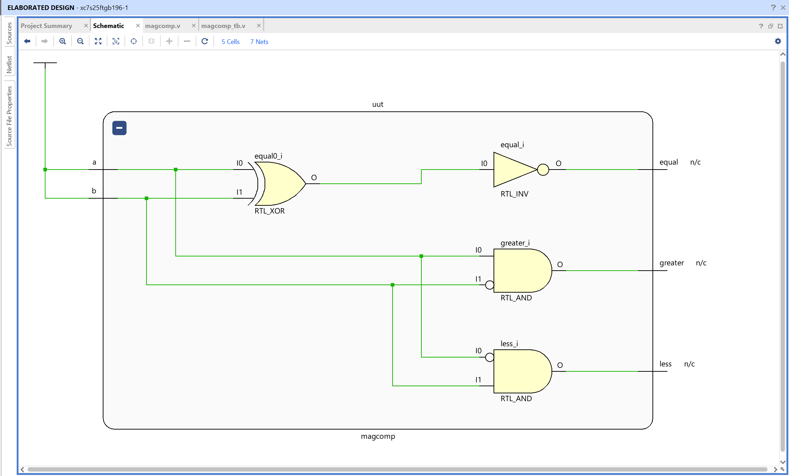
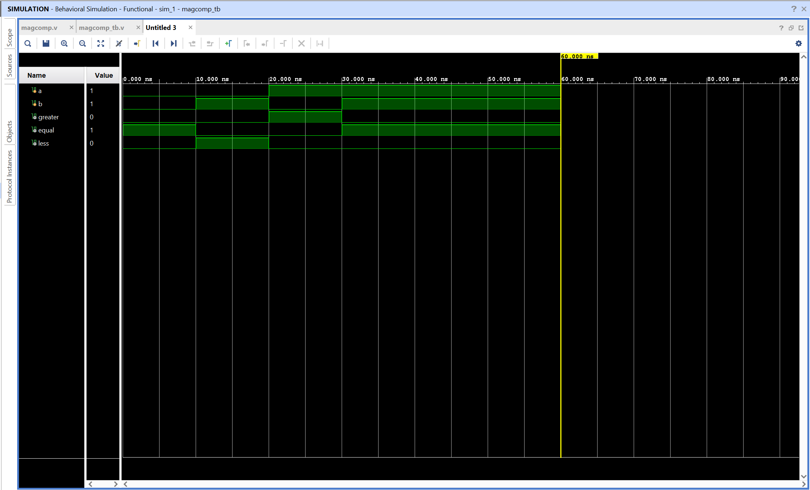

# 1-Bit Magnitude Comparator - Verilog Implementation

## Objective

Design and simulate a 1-bit magnitude comparator using Verilog in AMD Vivado.
The circuit compares two binary inputs and indicates whether input `a` is greater than, equal to, or less than input `b`.

## Magnitude Comparator

A magnitude comparator is a combinational circuit that compares two binary values. Since this design has one-bit inputs, each input can only be either 0 or 1.

The comparator produces three outputs:

- `greater`: high when `a > b`
- `equal`: high when `a = b`
- `less`: high when `a < b`

For every valid pair of inputs, exactly one of these outputs is high. This is sometimes called a one-hot result because one output represents the active comparison condition.

## Logic Equations

```text
greater = a & ~b
equal   = ~(a ^ b)
less    = ~a & b
```

The `greater` output is 1 only when `a` is 1 and `b` is 0. The `equal` output is 1 when both inputs have the same value. The `less` output is 1 only when `a` is 0 and `b` is 1.

## Truth Table

| A   | B   | A > B (`greater`) | A = B (`equal`) | A < B (`less`) |
| --- | --- | ----------------- | --------------- | -------------- |
| 0   | 0   | 0                 | 1               | 0              |
| 0   | 1   | 0                 | 0               | 1              |
| 1   | 0   | 1                 | 0               | 0              |
| 1   | 1   | 0                 | 1               | 0              |

## How the Output Works

The output signals should be interpreted together:

- For `a = 0` and `b = 0`, both values are the same, so `equal = 1`
- For `a = 0` and `b = 1`, `a` is smaller, so `less = 1`
- For `a = 1` and `b = 0`, `a` is larger, so `greater = 1`
- For `a = 1` and `b = 1`, both values are the same, so `equal = 1`

The three outputs are never high at the same time for these valid binary inputs. The output pattern `000` would indicate an unknown or invalid simulation condition rather than a normal comparison result.

## Module Interface

| Signal    | Width | Direction | Description                       |
| --------- | ----- | --------- | --------------------------------- |
| `a`       | 1     | Input     | First value to compare            |
| `b`       | 1     | Input     | Second value to compare           |
| `greater` | 1     | Output    | High when `a` is greater than `b` |
| `equal`   | 1     | Output    | High when `a` equals `b`          |
| `less`    | 1     | Output    | High when `a` is less than `b`    |

## Files

magcomp.v - Verilog design module implementing magnitude comparison logic
magcomp_tb.v - Testbench used to simulate all input combinations

## RTL Schematic



The RTL schematic shows the combinational logic that compares inputs **a** and **b** and drives the `greater`, `equal`, and `less` outputs.

## Simulation Waveform



The waveform verifies the comparator behavior over time. The testbench changes `a` and `b` through all four possible input combinations and observes the corresponding one-hot comparison result.

Observations:

- `greater` is high only for `a = 1`, `b = 0`
- `equal` is high when both inputs match
- `less` is high only for `a = 0`, `b = 1`
- Exactly one comparison output is high for every tested input pair

This confirms correct functionality of the 1-bit magnitude comparator.
