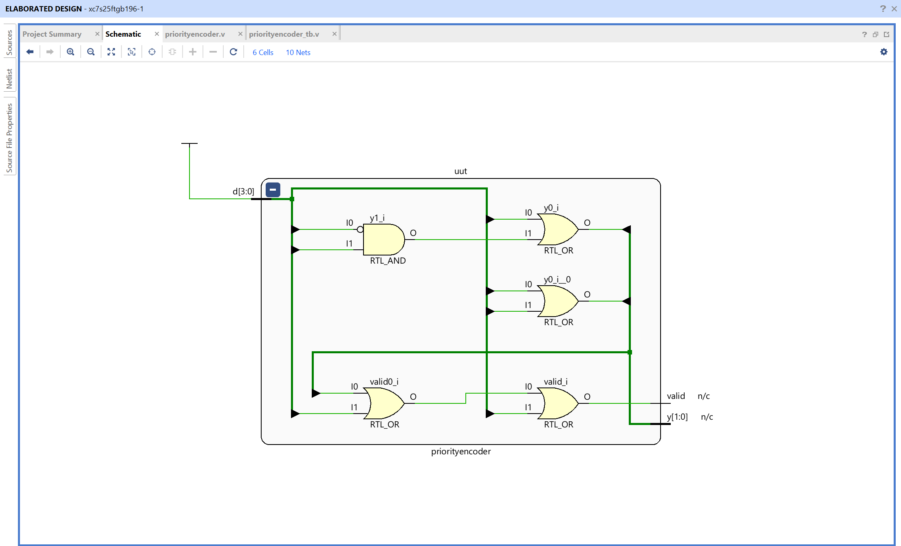
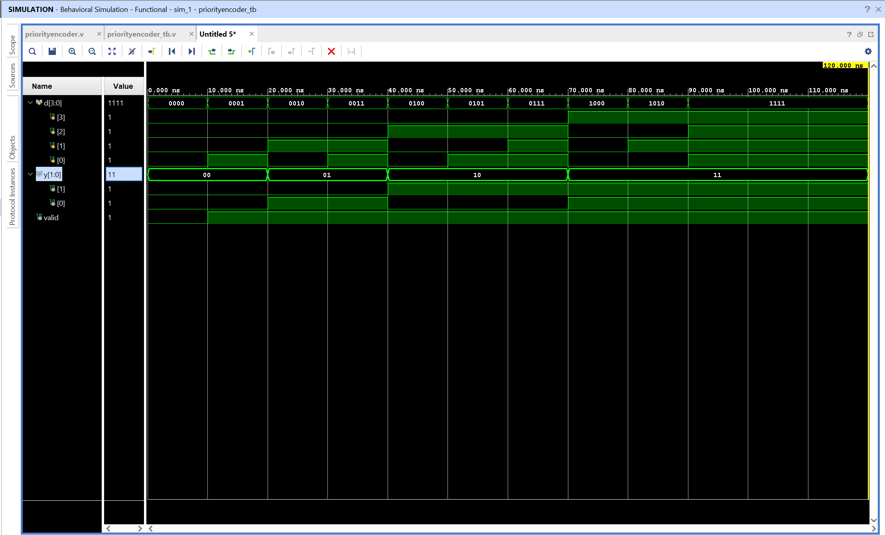

# 4-to-2 Priority Encoder - Verilog Implementation

## Objective

Design and simulate a 4-to-2 priority encoder using Verilog in AMD Vivado.
The circuit converts the highest-priority active input into a 2-bit binary code and provides a valid signal to indicate whether any input is active.

## What Is a Priority Encoder?

An ordinary encoder assumes that only one input is active at a time. A priority encoder also handles cases where several inputs are active by assigning each input a priority.

This design has four inputs, `d[3:0]`, and two encoded output bits, `y[1:0]`. The priority order is:

```text
d[3] > d[2] > d[1] > d[0]
```

If more than one input is 1, the circuit ignores the lower-priority active inputs and encodes the highest-priority 1. For example, if `d = 4'b1010`, both `d[3]` and `d[1]` are active, but `d[3]` has higher priority, so the output is `y = 2'b11`.

## Signals

- `d[3:0]`: Four input request or interrupt signals
- `y[1:0]`: Binary code for the highest-priority active input
- `valid`: High when at least one input is active

The `valid` output is important because `y = 2'b00` can mean either that input `d[0]` is active or that no input is active. The `valid` signal distinguishes these two situations.

## Priority Mapping

| Input condition            | Selected input | `y[1:0]` | `valid` |
| -------------------------- | -------------- | -------- | ------- |
| `d[3] = 1`                 | `d[3]`         | 11       | 1       |
| `d[3] = 0`, `d[2] = 1`     | `d[2]`         | 10       | 1       |
| `d[3:2] = 00`, `d[1] = 1`  | `d[1]`         | 01       | 1       |
| `d[3:1] = 000`, `d[0] = 1` | `d[0]`         | 00       | 1       |
| `d[3:0] = 0000`            | None           | 00       | 0       |

The conditions are checked from the highest-priority input downward. Once an active input is found, its binary index is presented on `y`.

## Logic Equations

The design implements the priority behavior with the following equations:

```text
y[1] = d[3] | d[2]
y[0] = d[3] | (~d[2] & d[1])
valid = d[3] | d[2] | d[1] | d[0]
```

The equation for `y[1]` is high when the selected input is either `d[2]` or `d[3]`. The equation for `y[0]` is high for `d[1]` or `d[3]`; the `~d[2]` term prevents `d[1]` from affecting the result when the higher-priority `d[2]` is active. When `d[3]` is active, both output bits become 1, regardless of lower-priority inputs.

## Complete Truth Table

| `d[3:0]` | Highest-priority active input | `y[1:0]` | `valid` |
| -------- | ----------------------------- | -------- | ------- |
| 0000     | None                          | 00       | 0       |
| 0001     | `d[0]`                        | 00       | 1       |
| 0010     | `d[1]`                        | 01       | 1       |
| 0011     | `d[1]`                        | 01       | 1       |
| 0100     | `d[2]`                        | 10       | 1       |
| 0101     | `d[2]`                        | 10       | 1       |
| 0110     | `d[2]`                        | 10       | 1       |
| 0111     | `d[2]`                        | 10       | 1       |
| 1000     | `d[3]`                        | 11       | 1       |
| 1001     | `d[3]`                        | 11       | 1       |
| 1010     | `d[3]`                        | 11       | 1       |
| 1011     | `d[3]`                        | 11       | 1       |
| 1100     | `d[3]`                        | 11       | 1       |
| 1101     | `d[3]`                        | 11       | 1       |
| 1110     | `d[3]`                        | 11       | 1       |
| 1111     | `d[3]`                        | 11       | 1       |

## Example of Priority Resolution

Consider the input:

```text
d = 4'b0111
```

Here, `d[2]`, `d[1]`, and `d[0]` are all 1. Because `d[2]` has higher priority than `d[1]` and `d[0]`, the encoder selects `d[2]` and produces:

```text
y = 2'b10
valid = 1'b1
```

The lower-priority active inputs do not change the output. This behavior is useful in interrupt controllers, arbitration circuits, and systems where the most important request must be handled first.

## Module Interface

| Signal  | Width | Direction | Description                             |
| ------- | ----- | --------- | --------------------------------------- |
| `d`     | 4     | Input     | Priority-encoded input signals          |
| `y`     | 2     | Output    | Binary code of the highest active input |
| `valid` | 1     | Output    | High when at least one input is active  |

## Testbench Behavior

The testbench applies these input patterns:

```text
0000, 0001, 0010, 0011, 0100,
0101, 0111, 1000, 1010, 1111
```

These patterns verify the no-input condition, individual active inputs, combinations of lower-priority inputs, combinations containing `d[3]`, and the case where all inputs are active.

## Files

priorityencoder.v - Verilog design module implementing the priority encoder
priorityencoder_tb.v - Testbench used to verify priority behavior

## RTL Schematic



The RTL schematic shows the combinational OR and AND logic used to encode the highest-priority active input and generate the `valid` signal.

## Simulation Waveform



The waveform verifies that the output code follows the highest-priority active input. It also shows `valid = 0` for `d = 0000` and `valid = 1` whenever at least one input is asserted.

Observations:

- `d[3]` has the highest priority
- `d[0]` has the lowest priority
- Lower-priority inputs do not affect the result when a higher-priority input is active
- `valid` indicates whether any input is active
- The output code identifies the highest-priority active input

This confirms correct functionality of the 4-to-2 priority encoder.
